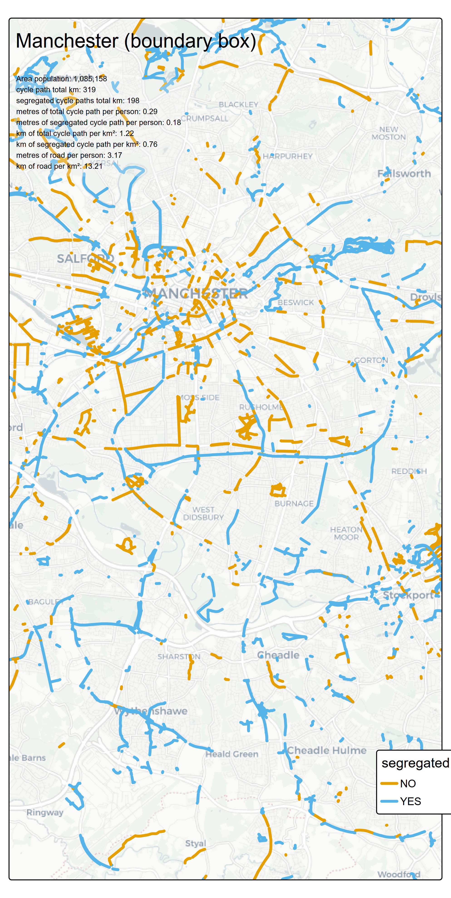
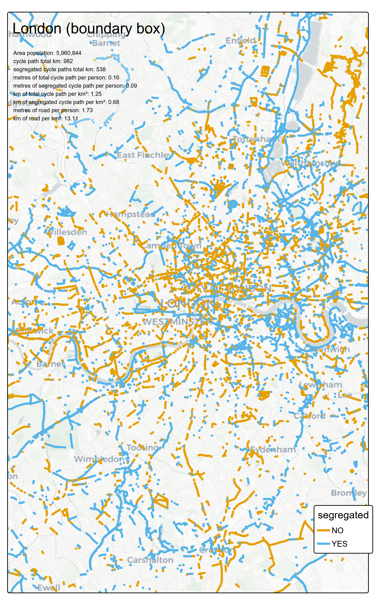

# Cycling Cities

Using the [osmactive package](https://github.com/nptscot/osmactive), the
cycle routes for a number of cities, picked for personal interest and
knowledge of which ones might have good infrastructure, were imported,
plotted and some stats calculated (table below).

    file:///C:/Users/blais/AppData/Local/Temp/Rtmpc5af87/file7308193d6a3e/widget73083a737a58.html screenshot completed

On average the Dutch cities have over 1metre of segregated cycle
infrastructure per person in each city. In the UK it is around half of
this.

A plot of some of the cities is shown below. An interactive plot is
shown in the tab [City Cycle
Paths](%22https://blaisekelly.github.io/cycle_cities/all_cities.html%22)

 
 
 
